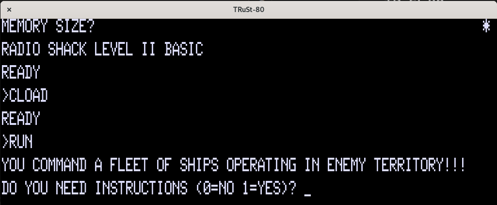

# TRuSt-80

[](https://crates.io/crates/trust-80)
[](https://crates.io/crates/trust-80)

TRuSt-80 is a cross-platform TRS-80 (model 1) emulator, based on my [Z80 emulator](https://github.com/nicolasbauw/ZilogZ80).
It has a working keyboard (hint : for " type shift+2 like on the original layout), can run Level 1 and Level 2 basic, and load .cas tape images.
You will need a ROM, and the [AnotherMansTreasureMIB64C2X3Y.ttf](https://www.kreativekorp.com/swdownload/fonts/retro/amtreasure.zip) font. If not already installed, you will need sdl2 and sdl2_ttf libraries.




You can customize the RAM, ROM and resolution, among other things, in the ~/.config/trust80/config.toml file.
The F12 key quits the emulator.


In the console, the `reset` command reboots the TRS-80.  
The `tape rewind` command is used to "rewind" the tape.  
The `tape` command followed by a filename is used to "insert" a tape:  

```
tape seawar4k.cas
```

Starting with version 0.10.0, there is an integrated machine language monitor:  
`d 0x0000` disassembles code at 0x0000 and the 20 next instructions.  
`m 0xeeee` displays memory content at address 0xeeee  
`m 0xeeee 0xaa` sets memory address to the 0xaa value  
`j 0x0000` jumps to 0x0000 address  
`b` displays set breakpoints  
`b 0x0002` sets a breakpoint at address 0x0002  
`f 0x0002` "frees" (deletes) breakpoint at address 0x0002  
`g` resumes execution after a breakpoint has been used to halt execution  
`r` displays the contents of flags and registers