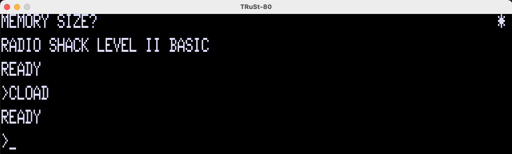

# TRuSt-80

TRuSt-80 is a cross-platform TRS-80 (model 1) emulator, based on my [Z80 emulator](https://github.com/nicolasbauw/ZilogZ80).
It has a working keyboard, can run Level 1 and Level 2 basic, and load .cas tape images.
You will need a ROM, and the [AnotherMansTreasureMIB64C2X3Y.ttf](https://www.kreativekorp.com/swdownload/fonts/retro/amtreasure.zip) font. If not already installed, you will need sdl2 and sdl2_ttf libraries.




You can customize the RAM, ROM and resolution, among other things, in the config.toml file.
The F7 key is used to "rewind" the tape (the "tape rewind" command in console has the same effect).
The F8 key reboots the TRS-80.
The F12 key quits the emulator.

In the console, the "tape" command is used to "insert" a tape:
```
tape seawar4k.cas
```
