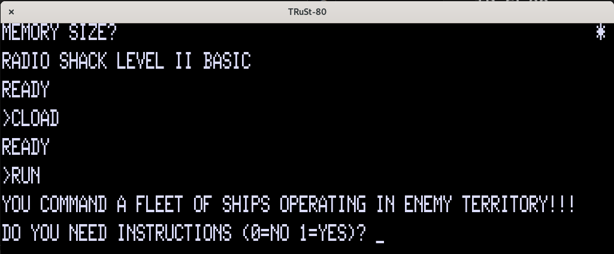

# TRuSt-80

TRuSt-80 is a cross-platform TRS-80 (model 1) emulator, based on my [Z80 emulator](https://github.com/nicolasbauw/ZilogZ80).
It has a working keyboard (mapped by the character your keyboard actually produces, not by the TRS-80's original key positions - type the key that types `"` on your keyboard and you'll get `"` on screen), can run Level 1 and Level 2 basic, and load .cas tape images.
You will need a ROM, and the [AnotherMansTreasureMIB64C2X3Y.ttf](https://www.kreativekorp.com/swdownload/fonts/retro/amtreasure.zip) font. If not already installed, you will need sdl2 and sdl2_ttf libraries.

You can customize the RAM, ROM and resolution, among other things, in the ~/.config/trust80/config.toml file.
Close the window to quit the emulator. F1-F3 set the display zoom (half, normal, x2), F4 toggles fullscreen. F5 toggles the CRT shader, F6 opens its settings panel (also lets you set the startup zoom level, saved to config.toml). F11 opens the console (replaces the old terminal-based console). F12 opens the machine status panel (registers, hardware).

In the console, the `reset` command resets the TRS-80.  
The `powercycle` command (or `pc`) resets the TRS-80 and clears the RAM.  
The `tape rewind` command is used to "rewind" the tape.  
The `tape` command followed by a filename is used to "insert" a tape.  
Type `help` to display available commands.  

There is also an integrated machine language monitor:  
`d 0x0000` disassembles code at 0x0000 and the 20 next instructions.  
`m 0xeeee` displays memory content at address 0xeeee  
`m 0xeeee 0xaa` sets memory address to the 0xaa value  
`j 0x0000` jumps to 0x0000 address  
`b` displays set breakpoints  
`b 0x0002` sets a breakpoint at address 0x0002  
`f 0x0002` "frees" (deletes) breakpoint at address 0x0002  
`p` pauses execution immediately  
`g` resumes execution (after a breakpoint or `p`)  
`n` executes a single instruction (usually while paused)  
`r` displays the contents of flags and registers  
`hw` displays hardware peripheral status (tape)